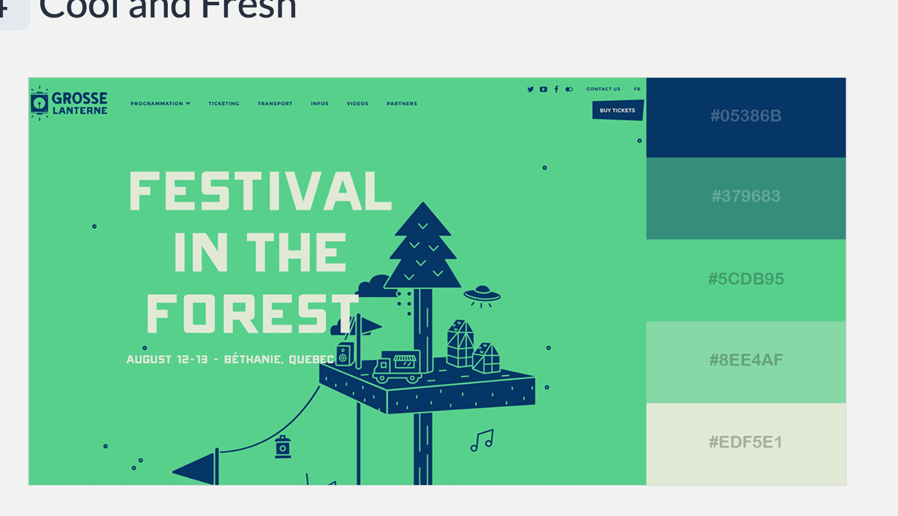

# Kurse der Berliner Volkshochschulen - KBV (Fake-Abschlussprojekt)

# 1. Ideen
## 1.1. Liste der optimalen APIs und Json-Dateien

* __BreweryDB__ - Beer, beer and more beer!
    * Sandbox - Free up to 10k requests a day
    * Paid plans available
    * List beers and breweries

* __Nasa APIs__
    * Tutorial : (ab der Minute 06:00) https://www.youtube.com/watch?v=v2bi4a2iMf0 
    * Requires API key
    * Has astronomy picture of the day
    * event trackers for natrual events
    * Mars weahter service : LUSTIG!
    * Rover images
    
* __Reddit__
    * just add .json - ``rediit.com/r/webdev.json``
    * Great to grap pictures data and more
    * No auhtentication needed
    * beginner friendly
    * for example "Grabbing favorite Subreddit Headlines"
    
* __OpenWeatherMap__
    * 60 calls per minute with free plan
    * 5 days , 3 days forecase
    * Weather APIs sometimes go down and changes, so they are NOT RELIABLE that much. But this one is almost reliable
    
* __YouTube API__
    * Little more complicated, can grab a bunch of information
    * List channels by ID
    * Grab Playlist
    * Search
    * Grab comments

* Berliner Hochschulkursen : https://daten.berlin.de/datensaetze/kurse-der-berliner-volkshochschulen
___
___
___

# Project: Berliner Kurse

# 0. Details
* Anzahl der Datensätze : 1877

# 1. Report

## 1.1. Bearbeitung der Rohdaten
Wegen einer Schlüssel in den JSON-Rohdaten von der Quelle, der ``"#test"`` (siehe in ``sample-raw.json``) lautet mussten alle 1877 Datensätze bearbeitet werden. 

Die Formattierung des obengenannten Schlüssels ist bei der angewendeten Datenbank (Firebase) nicht gültig.

Da dieser Schlüsser und deren Eltern keine große Rolle in der Applikation spielen wurden sie aus den Datensätzen gelöscht. 

## 1.2. Datenanalyse
Ich werde prüfen welche Attributen und Daten in jedem Kurs verfügbar ist.

# 1.3. Components

## 1.3.1. Applikationsbaumstruktur:
```
app: 
{
    layout: 
    {
        cards: 
        {
            card   
        },

        nav: 
        {
           navItems    
        },

        search: 
        {
               
        },

        advSearch: 
        {
               
        },
    }
}
```


## 1.3.2. UI Components
 
___

# 2. Implementierung (Tickets)
## TODO 
* __Priority: High, Next:__
    * CourseCard Infos
    * NavListItems Hover!
    * Spinner For The Card Container - (It takes a fraction of time until the data is loaded from Firebase, so it would be nice if we have a Spinner there.)
    * Add Redux (and with Redux Pass the Amount of Loaded Courses (now = 10) from ``Courses`` cmp to the ``Search`` SideBar cmp.)
    * Style the course-cards.
    * Add "Load-More" BTN : So when the User clicks on it, 5 more courses get loaded.
    * Detail-BTN on the Course-Cards and Creating DetailedCourse CMP with all the details of the course.
    * Einen angebrachten Text für die Home-Seite.

* __Priority: Low__
    * Add Images to course-cards
    * Small Devices Styling
    * Add favourite fonts.

* __DONE:__  
    * Big Showcase as homepage!!!
    * Create primary cmps.
    * Cards & Card anlegen
    * Add Routes ('/', '/courses')
    * Add Header-Cmp
    * Header for Home! with Logic!
    * Add Search Side-Drawer.
    * Add Logo
    * Add a nice page 404!
    * Cart Buttons Styling
___

## 2.999. Extras
* Cart cmp and Order cmp For Users (so that they can add the Courses into the Cart and then Order them)
___

# 3. Designs

## Colors



BEST Of https://visme.co/blog/website-color-schemes/ :

* Number 24
* Number 48
___

## Favorite Fonts

* Montserrat
* Montserrat Alternates
* Convergence
* Zilla Slab
* Rubik

___

# 99. Quellen
* https://unsplash.com/